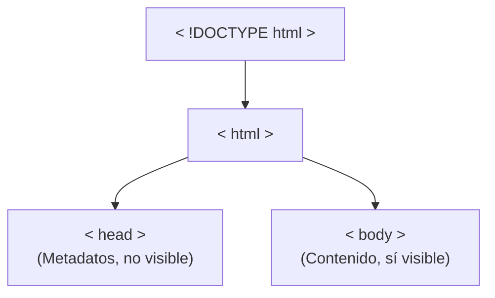

***

### **Apartado 1: ¿Qué es HTML?**

#### **Explicación:**

HTML, que significa **HyperText Markup Language** (Lenguaje de Marcas de Hipertexto), es el lenguaje que se utiliza para crear la estructura y el contenido de las páginas web.

*   No es un lenguaje de programación, sino un **lenguaje de marcado**. Esto significa que usa "marcas" o **etiquetas** para decirle al navegador qué es cada parte del contenido (un título, un párrafo, una imagen, un enlace, etc.).
*   Fue creado por Tim Berners-Lee en 1989.
*   El navegador (como Chrome, Firefox, etc.) interpreta el código HTML y muestra el resultado visualmente.
*   Una de sus características más importantes son los **hipervínculos**, que son los enlaces que nos permiten navegar de una página a otra.

> **En resumen:** HTML es el esqueleto de cualquier página web.

***

### **Apartado 2: La Estructura Básica de un Documento HTML**

#### **Explicación:**

Todo archivo HTML tiene una estructura fundamental que actúa como una plantilla. Esta estructura se compone de etiquetas esenciales que definen las diferentes partes del documento.

La estructura visual es la siguiente:



#### **Ejemplo Práctico de la Estructura Básica:**

Este es el código mínimo que toda página HTML debe tener. Puedes copiarlo, guardarlo en un archivo con extensión `.html` (por ejemplo, `mi_pagina.html`) y abrirlo en un navegador.

```html
<!DOCTYPE html>
<html lang="es">
<head>
    <!-- Aquí va información para el navegador, como el título de la pestaña -->
</head>
<body>
    <!-- Aquí va todo el contenido que el usuario verá en la página -->
</body>
</html>
```

***

### **Apartado 3: Las Etiquetas Estructurales Principales**

#### **1. La Declaración `<!DOCTYPE html>`**

*   **¿Qué hace?**: Es una instrucción obligatoria que siempre va en la **primera línea** del archivo. Le dice al navegador que el documento está escrito en la versión más moderna de HTML (HTML5).
*   **Nota Importante**: En versiones antiguas de HTML (como HTML 4.01), esta declaración era mucho más larga y compleja porque se basaba en "DTD" o gramáticas. Hoy en día, con HTML5, se ha simplificado enormemente.

*   **Ejemplo Práctico:**
    ```html
    <!DOCTYPE html>
    ```

#### **2. La Etiqueta `<html>`**

*   **¿Qué hace?**: Es la etiqueta raíz que envuelve todo el contenido de la página. Indica el inicio y el fin del documento HTML.
*   **Atributo `lang`**: Es una buena práctica incluir el atributo `lang` para definir el idioma de la página (ej. "es" para español, "en" para inglés). Esto ayuda a los motores de búsqueda y a las herramientas de accesibilidad.

*   **Ejemplo Práctico:**
    ```html
    <html lang="es">
      <!-- Todo el resto del código va aquí -->
    </html>
    ```

#### **3. La Etiqueta `<head>` (Cabecera)**

*   **¿Qué hace?**: Contiene los **metadatos** de la página. Esta información no es visible directamente en el contenido de la web, pero es crucial para el navegador y para los buscadores como Google.
*   **¿Qué se pone aquí dentro?**: El título que aparece en la pestaña del navegador (`<title>`), la codificación de caracteres para que se vean bien las tildes y las "ñ" (`<meta charset="UTF-8">`), enlaces a archivos CSS para dar estilo, etc.

*   **Ejemplo Práctico:**
    ```html
    <head>
        <meta charset="UTF-8">
        <title>Este es el título de la pestaña</title>
    </head>
    ```

#### **4. La Etiqueta `<body>` (Cuerpo)**

*   **¿Qué hace?**: Esta es la parte más importante para el usuario. Contiene **todo el contenido visible** de la página web: textos, títulos, imágenes, vídeos, enlaces, listas, etc.
*   Solo puede haber una etiqueta `<body>` por documento.

*   **Ejemplo Práctico:**
    ```html
    <body>
        <h1>¡Hola, Mundo!</h1>
        <p>Este es mi primer párrafo en HTML.</p>
    </body>
    ```

***

### **Apartado 4: Sintaxis y Reglas de Estilo en HTML5**

#### **Explicación:**

HTML5 es muy flexible, pero para escribir un código limpio y profesional que sea fácil de mantener, se recomienda seguir estas pautas:

1.  **Usar siempre minúsculas**: Escribe todas las etiquetas y atributos en minúsculas. Es el estándar actual.
    *   **Mal:** `<BODY>`
    *   **Bien:** `<body>`

2.  **Usar comillas dobles para los atributos**: Encierra siempre los valores de los atributos entre comillas dobles.
    *   **Mal:** `<html lang=es>`
    *   **Bien:** `<html lang="es">`

3.  **Utilizar sangrado (indentación)**: Usa espacios o tabulaciones para anidar el código. Esto hace que la estructura sea mucho más fácil de leer y entender.

#### **Ejemplo Práctico de Código Limpio:**

Observa cómo el sangrado ayuda a ver qué etiquetas están dentro de otras.

```html
<!DOCTYPE html>
<html lang="es">
    <head>
        <meta charset="UTF-8">
        <title>Mi Página Bien Escrita</title>
    </head>
    <body>
        <h1>Un título bien indentado</h1>
        <p>
            Y un párrafo también.
        </p>
    </body>
</html>
```
